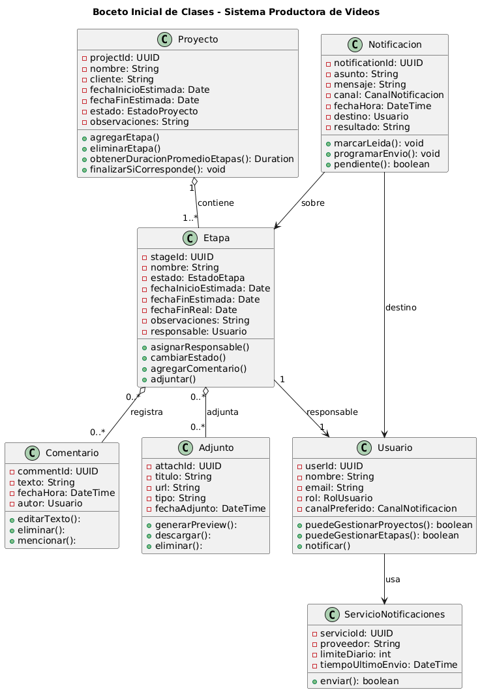

# Anexo - Introducción al Diseño Orientado a Objetos

El paradigma orientado a objetos (abreviado POO), es un modelo de programación que organiza y forma al sistema como un conjunto de objetos los cuales representan entidades del mundo real o conceptos abstractos. Los objetos poseen atributos (datos o propiedades) los cuales describen su estado y como es el objeto, y métodos (funcionalidades y comportamientos) los cuales definen que cosas puede hacer el objeto.
Una de las mayores ventajas del POO es que los programas se centran en clases (tipos) y objetos (instancias), encapsulando datos y operaciones para reducir complejidad y facilitar mantenimiento y reutilización.

## Los cuatro fundamentos del POO

### 1. Abstracción
**Concepto:** identificar y representar solo las características esenciales de un objeto del mundo real en el sistema, dejando de lado los detalles innecesarios para el contexto.

**Ejemplo:**  
En el sistema, un supuesto **ProyectoAudiovisual** se abstrae como un objeto con atributos como *nombre, cliente, fechas, etapas, estado*.  
No es necesario modelar detalles irrelevantes como el color del logo del cliente, el modelo de cámara usada en la grabación o la tipografía del contrato.  
La abstracción permite enfocarse en lo que es relevante para gestionar y dar seguimiento a un proyecto, sin cargar el sistema con datos irrelevantes que no aportan al objetivo.

---

### 2. Encapsulamiento
**Concepto:** proteger los datos de un objeto controlando el acceso mediante métodos.  

**Ejemplo:**  
Una supuesta clase **Etapa** guardaría los valores `estado` y `responsable`.  
Estos valores no tendrían que poder ser modificados directamente, salvo mediante métodos como `cambiarEstado()` o `asignarResponsable()`, asegurando consistencia.

---

### 3. Herencia
**Concepto:** crear nuevas clases a partir de otras, reutilizando atributos y métodos comunes.  

**Ejemplo:**  
Una clase **Usuario** general, de la cual heredan **Productor**, **Editor**, **Asistente**, y más adelante **Cliente**.  
Cada uno puede tener atributos y permisos adicionales.

---

### 4. Polimorfismo
**Concepto:** distintas clases pueden responder de manera diferente al mismo mensaje o método.  

**Ejemplo:**  
Un supuesto método `notificar()` puede enviar un **mail** si el responsable prefiere correo, o un **mensaje de WhatsApp** si así está configurado.  
Es el mismo método, pero distinto comportamiento según el objeto.

## Requisitos iniciales del sistema

### Requisitos funcionales:

- **RF01. Administración de proyectos:** El sistema debe permitir **crear y editar proyectos**, registrando al menos: nombre, cliente, fechas de inicio y fin estimadas, estado actual y observaciones.  

- **RF02. Gestión de etapas:** El sistema debe permitir **agregar y modificar etapas** en un proyecto, indicando responsable, estado (Pendiente, En curso, Finalizada), fechas estimadas y observaciones.

- **RF03. Tablero de control:** El sistema debe mostrar un **panel general** donde se visualice el estado de todos los proyectos y sus etapas, indicando si están en curso, finalizados o pausados y el responsable de cada etapa.
  
- **RF04. Notificaciones automáticas:** El sistema debe **enviar notificaciones automáticas** (por mail y WhatsApp) al responsable cuando:  
  - Se le asigna una nueva etapa.  
  - Cambia el estado de su etapa.  
  - Una etapa a su cargo pasa a “Finalizada”.

- **RF05. Registro estadístico:** El sistema debe permitir **consultar métricas** de proyectos y etapas, incluyendo:  
  - Cantidad de proyectos entregados por mes.  
  - Duración promedio de proyectos y etapas.  
  - Proyectos filtrados por cliente o tipo.
    
- **RF06. Historial de tareas:** El sistema debe **registrar automáticamente** qué usuario completó cada tarea y los cambios de estado de cada etapa.

### Requisitos no funcionales:

- **RNF01. Accesibilidad multiplataforma:** El sistema debe estar disponible desde **navegadores web de escritorio y móviles** (Chrome, Edge, Safari) y ser responsive en pantallas de al menos 5” de ancho.

- **RNF02. Facilidad de uso:** El sistema debe permitir que **un usuario nuevo realice su primera acción (crear proyecto o etapa)** en menos de **10 minutos de aprendizaje autónomo**, con menús y filtros accesibles.

- **RNF03. Disponibilidad:** El sistema debe estar disponible al menos el **99% del tiempo**, excluyendo mantenimientos planificados.

- **RNF04. Escalabilidad:** El sistema debe soportar la gestión de al menos **100 proyectos en simultáneo**, con posibilidad de extender a nuevas funciones como facturación sin rediseño completo.

- **RNF05. Guardado de datos:** El sistema debe guardar automáticamente cada cambio en proyectos y etapas en menos de **2 segundos**, garantizando persistencia aunque se recargue la página.

- **RNF06. Rendimiento:** El sistema debe permitir consultar y filtrar proyectos sin que el tiempo de respuesta supere **3 segundos** en escenarios con hasta **50 proyectos activos y 200 etapas**.

## Casos de uso

### CU01 – Crear/Editar Proyecto (RF01)
- **Actor principal:** Productor / Coordinador  
- **Objetivo:** Registrar o actualizar un proyecto con los campos mínimos.  
- **Precondiciones:** Usuario autenticado con permiso; el nombre del proyecto no debe estar duplicado.  
- **Flujo principal:**  
  1. El actor navega a **Proyectos** y selecciona **Nuevo** o **Editar**.  
  2. El sistema muestra un **formulario** con campos: nombre, cliente, fechas de inicio y fin estimada, estado, observaciones.  
  3. El actor **completa** los campos obligatorios.  
  4. El sistema **valida** (obligatorios, formato de fechas, duplicados de nombre).  
  5. Si hay errores, el sistema **resalta** los campos inválidos y muestra mensajes.  
  6. El actor **corrige** y reenvía.  
  7. El sistema **persiste** el proyecto y registra auditoría (quién/cuándo).  
  8. El sistema **confirma** y redirige al detalle del proyecto.  
- **Flujos alternativos:** Campos obligatorios incompletos o nombre duplicado → rechazo con mensaje.  
- **Postcondiciones:** Proyecto persistido y disponible en listados/tablero.

---

### CU02 – Gestionar Etapas de un Proyecto (RF02)
- **Actor principal:** Coordinador  
- **Objetivo:** Agregar, editar o eliminar etapas de un proyecto.  
- **Precondiciones:** Proyecto existente; actor con permisos.  
- **Flujo principal:**  
  1. El actor abre el **detalle del proyecto** y selecciona **Gestionar etapas**.  
  2. El sistema muestra la **lista de etapas** (si existen).  
  3. El actor elige **Agregar**, **Editar** o **Eliminar**.  
  4. El sistema despliega formulario con **nombre, responsable, estado, fechas estimadas, observaciones**.  
  5. El actor completa o modifica los campos y confirma.  
  6. El sistema **valida** (responsable válido, fechas coherentes, estado permitido).  
  7. El sistema **guarda** los cambios y registra el evento (alta/edición/baja).  
  8. El sistema **actualiza** la lista y muestra confirmación.  
- **Flujos alternativos:** Responsable inexistente o fechas inválidas → rechazo con mensaje.  
- **Postcondiciones:** Etapas actualizadas y reflejadas en el tablero.

---

### CU03 – Asignar Responsable a Etapa (RF02, RF04, RF06)
- **Actor principal:** Coordinador  
- **Objetivo:** Asignar o cambiar el responsable de una etapa y notificarlo.  
- **Precondiciones:** Etapa existente; usuario válido en el sistema.  
- **Flujo principal:**  
  1. El actor abre el **detalle** del proyecto y selecciona una etapa.  
  2. El sistema muestra los datos actuales de la etapa.  
  3. El actor hace clic en **Asignar/Cambiar responsable**.  
  4. El sistema despliega un **selector de usuarios**.  
  5. El actor elige al responsable y confirma.  
  6. El sistema valida el usuario y actualiza la etapa.  
  7. El sistema registra el cambio en el **historial** (quién, a quién, cuándo).  
  8. El sistema dispara una **notificación** al nuevo responsable.  
- **Flujos alternativos:** Usuario inactivo o sin permisos → rechazo.  
- **Postcondiciones:** Responsable asignado; notificación enviada; historial actualizado.

---

### CU04 – Cambiar Estado de Etapa (RF02, RF04, RF06)
- **Actor principal:** Responsable de la etapa / Coordinador  
- **Objetivo:** Modificar el estado de una etapa respetando reglas de negocio.  
- **Precondiciones:** Etapa existente; usuario con permisos.  
- **Flujo principal:**  
  1. El actor abre el detalle de la etapa.  
  2. El sistema muestra estado actual y opciones: Pendiente, En curso, Finalizada.  
  3. El actor selecciona un nuevo estado y confirma.  
  4. El sistema valida reglas (p.ej. no finalizar si tareas incompletas).  
  5. Si no se cumplen, muestra error.  
  6. Si se cumplen, actualiza el estado.  
  7. El sistema registra el cambio en **historial**.  
  8. El sistema envía notificación a los interesados.  
- **Flujos alternativos:** Reglas incumplidas → no actualizar y avisar.  
- **Postcondiciones:** Estado actualizado; historial y notificaciones registradas.

---

### CU05 – Consultar Reportes/Métricas (RF05, RNF06)
- **Actor principal:** Productor / Coordinador  
- **Objetivo:** Obtener métricas de proyectos y etapas con filtros.  
- **Precondiciones:** Existencia de datos; usuario con permisos.  
- **Flujo principal:**  
  1. El actor accede a **Reportes**.  
  2. El sistema muestra filtros (cliente, tipo, fechas).  
  3. El actor configura y aplica los filtros.  
  4. El sistema consulta datos y calcula métricas (proyectos finalizados por mes, duración promedio, tipo más frecuente).  
  5. El sistema muestra visualizaciones (tabla/gráfico).  
  6. El actor aplica filtros adicionales o cambia parámetros.  
  7. El sistema actualiza resultados en ≤3 segundos.  
  8. El actor exporta a PDF/CSV si desea.  
- **Flujos alternativos:** Sin datos → mensaje “sin resultados”.  
- **Postcondiciones:** Reporte visualizado/exportado.

---

### CU06 – Mostrar Tablero de Control (RF03)
- **Actor principal:** Usuario autenticado  
- **Objetivo:** Visualizar estado general de proyectos y etapas.  
- **Precondiciones:** Usuario autenticado; datos registrados.  
- **Flujo principal:**  
  1. El actor abre **Tablero** desde menú.  
  2. El sistema carga el resumen de proyectos.  
  3. El sistema muestra tarjetas con estado, avance y responsables.  
  4. El actor aplica filtros (estado, cliente, tipo).  
  5. El sistema actualiza resultados.  
  6. El actor expande un proyecto para ver etapas.  
  7. El sistema muestra detalles de etapas.  
  8. El actor navega a detalle o exporta resumen.  
- **Flujos alternativos:** Sin proyectos → mensaje “Crear proyecto”.  
- **Postcondiciones:** Estado general visible; navegación habilitada.

---

### CU07 – Enviar Notificaciones Automáticas (RF04, RF06)
- **Actor principal:** Sistema de Notificaciones (mail/WhatsApp).  
- **Objetivo:** Avisar a responsables ante eventos relevantes.  
- **Precondiciones:** Usuario con canal definido; conexión con proveedor.  
- **Flujo principal:**  
  1. Ocurre evento (asignación de responsable o cambio de estado).  
  2. El sistema identifica destinatarios.  
  3. El sistema determina canal de notificación.  
  4. El sistema compone mensaje con datos del proyecto/etapa.  
  5. El sistema envía la notificación.  
  6. El proveedor devuelve resultado (éxito/fallo).  
  7. El sistema registra el envío en historial.  
  8. Si falla, reintenta o marca para revisión.  
- **Flujos alternativos:** Usuario sin preferencia → canal por defecto; proveedor caído → reintento.  
- **Postcondiciones:** Notificación registrada; destinatarios informados.

## Boceto inicial del diseño de clases

### Diagrama de Clases Iniciales

El siguiente diagrama corresponde al diseño de clases iniciales para el sistema:

[🔗 Ver diagrama en GitHub](../diagramas/01-diagrama-clases/01-boceto-inicial.png)